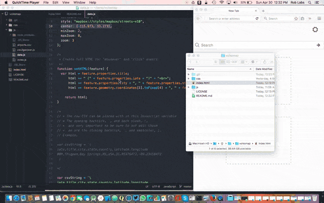

# Volksmap • People's Map

Volksmap — Add your own points of interest, in CSV format, to a Mapbox map.

The goal of Volksmap is to allow people to easily add their own CSV data to a map.  
Friction, pitfalls and consternation have been minimized, allowing more people to maintain and edit more maps.  
We built a tiny map based CMS; a **C**ontent **M**ap **S**ystem that anyone can edit and host.

This example shows editing CSV data and launching from a local HTML file.  Then hovering over points of interest shows a basic Popup with HTML.

-----

-----

Mapbox has an example on [Loading markers from CSV](https://www.mapbox.com/mapbox.js/example/v1.0.0/markers-from-csv/).  The example uses [Mapbox.js](https://www.mapbox.com/mapbox.js/) and [Leaflet](http://leafletjs.com/)'s [Omnivore](https://github.com/mapbox/leaflet-omnivore) to parse a CSV file.

And we ported that over to [Mapbox GL JS](https://www.mapbox.com/mapbox-gl-js/api).

## Features

* Edit the map and run locally, or an any server.
  * Including with any web server such as [Jekyll](http://jekyllrb.com) or [Github Pages](https://pages.github.com)
  * or without, `file:///volksmap/index.html`
* Is free of issues with [cross-domain request](https://github.com/mapbox/leaflet-omnivore#faq), as most people won't know what to do or how to solve.
* CSV data is converted to [GeoJSON](https://tools.ietf.org/html/rfc7946)

## Contribute

* Fork or download this project
* edit your parameters in `js/data.js`
  * Insert your CSV data
  * Set your Mapbox style
  * Customize your HTML for a Mapbox Popup

# Built with

* [Mapbox](http://mapbox.com)
* [csv2geojson](https://www.npmjs.com/package/csv2geojson) from [NPM](https://www.npmjs.com)
* The excellent tools from [RunKit.com](https://runkit.com/5905f3fc301f4d00129331a6/5906060aad0c6400123b0ad4)
